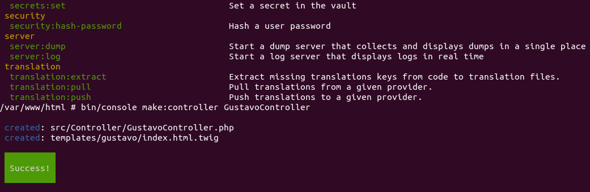

# My Symfony Project

```
```

```
composer create-project symfony/symfony-demo my_project
```

```
bin/console make:controller GustavoController
```

### ./src/Controller/GustavoController.php
```php
namespace App\Controller;

use Symfony\Bundle\FrameworkBundle\Controller\AbstractController;
use Symfony\Component\HttpFoundation\Response;
use Symfony\Component\Routing\Annotation\Route;

class GustavoController extends AbstractController
{
    #[Route('/gustavo', name: 'app_gustavo')]
    public function index(): Response
    {
        $number = random_int(0, 100);

        return new Response(
            '<html><body>Lucky number: '.$number.'</body></html>'
        );
    }
}
```

### ./config/routes.yaml
```yaml
# the "app_lucky_number" route name is not important yet
app_lucky_number:
    path: /gustavo/number
    controller: App\Controller\GustavoController::index
```

### Result Example
```
http://localhost/gustavo/number

Lucky number: 47

```


